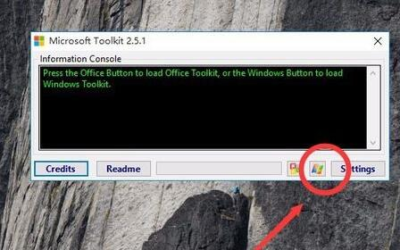

**Microsoft Toolkit如何激活Win10**

　　第一步：由于，已经介绍过[win10](http://www.jiaochengzhijia.com/win10/)的安装过程，所以，这里，我直接为大家讲Microsoft Toolkit怎么使用！双击打开，Microsoft Toolkit工具。

　　第二步：选择右小角的微软图标

　　第三步：选择Activation，然后在Tool下选择KMS Server Service，tor，

　　第四步：点击EZ-Activa

　　待滚动下方滚动条结束，滚动时，激活成功！

　　验证一下，找到计算机，右键—属性！ok！看下方是否显示已激活！如果没有成功，回到第三步，在TOOL下，重新选择一种激活方式！

　　**Win10如何使用Microsoft Toolkit？需要注意什么？**

　　1、下载好Office Tollkit工具以后，点击下图所示的位置。进入Microsoft Toolkit设置界面。

　　2、进入Microsoft Toolkit设置界后，点击Activation 选项卡下面选择要安装一个AutoKMS如下图所示操作。

　　3、再点击Product Keys选项卡下面选择你要激活的软件，选好软件版本以后，点击【Install】安装好以后，就需要重启[电脑](https://www.jiaochengzhijia.com/digital/taishi/)，此时再运行软件就激活了。

　　4、重启电脑后如果360提示是否禁用AutoKMS一定不能禁用，如果禁用了Microsoft Toolkit所做的激活动作都没有效果了。

路径：https://www.jiaochengzhijia.com/win10/6993.html

