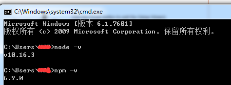
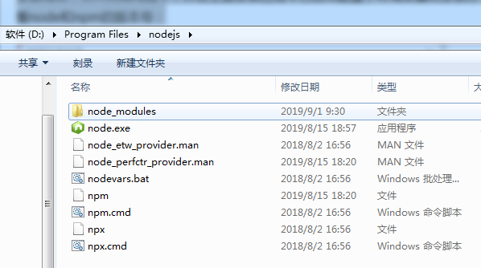
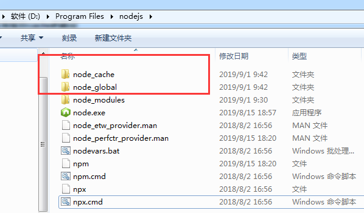
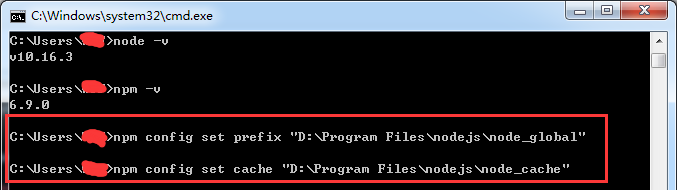
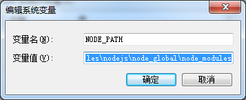
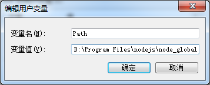
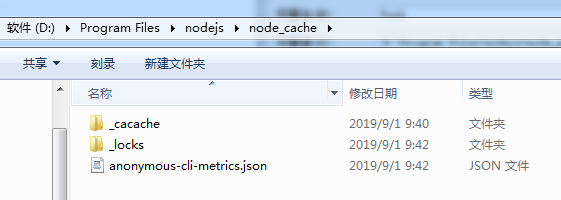
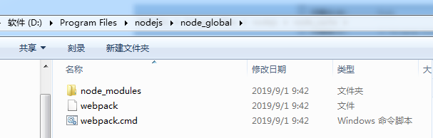

Node.js 官方网站下载：https://nodejs.org/en/download/

选择适合自己电脑的型号，双击点开（傻瓜式安装，注意：安装路径可换：D:\Program Files\nodejs）

安装成功，测试安装是否成功，运行CMD，分别输入**node -v** 和 **npm -v** 分别查看node和npm的版本号，如下图所示：



安装完成后系统目录如图所示（其中，npm随安装程序自动安装，作用就是对Node.js依赖的包进行管理）：



#### 配置npm在安装全局模块时的路径和缓存cache的路径

因为在执行例如npm install webpack -g等命令全局安装的时候，默认会将模块安装在C:\Users\用户名\AppData\Roaming路径下的npm和npm_cache中，不方便管理且占用C盘空间，

所以这里配置自定义的全局模块安装目录，在node.js安装目录下新建两个文件夹 node_global和node_cache，如图所示：



然后在cmd命令下执行如下两个命令：

```cmd
npm config set prefix "D:\Program Files\nodejs\node_global"

npm config set cache "D:\Program Files\nodejs\node_cache"
```

如下图所示：



执行完后，配置环境变量，如下：

- “环境变量” -> “系统变量”：新建一个变量名为 “**NODE_PATH**”， 值为**“D:\Program Files\nodejs\*\*node_global\node_modules\****”，如下图：



- “环境变量” -> “用户变量”：编辑用户变量里的**Path**，将相应npm的路径（“C:\Users\用户名\AppData\Roaming\npm”）改为：“**D:\Program Files\nodejs\node_global**”，如下：



配置完成

### 测试

在cmd命令下执行 **npm install webpack -g** 安装webpack**，或者	npm install vue-cli -g**如下图所示：

安装成功，自定义文件夹如下所示：



