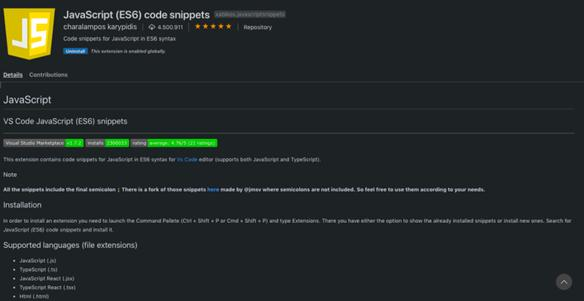

## 一. vetur

vetur能够实现在 .vue 文件中：

- 语法错误检查，包括 CSS/SCSS/LESS/Javascript/TypeScript
- 语法高亮，包括 html/jade/pug css/sass/scss/less/stylus js/ts emmet 支持
- 代码自动补全（目前还是初级阶段），包括 HTML/CSS/SCSS/LESS/JavaScript/TypeScript 配合 ESLint 插件使用效果更佳

## 二.eslint

- eslint插件能够检测代码语法问题，与格式问题，对项目代码风格统一至关重要。

## 三.EditorConfig for Visual Studio Code

- EditorConfig 是一种被各种编辑器广泛支持的配置，使用此配置有助于项目在整个团队中保持一致的代码风格。

## 四.Path Intellisense

- 在编辑器中输入路径时，自动补全。

 

## 五.View In Browser

- 在浏览器中查看静态文件。

 

## 六.Live Server

　　这个插件很有用，安装之后可以打开一个简单的服务器。而且还会自动更新。安装之后，打开项目文件夹，再在文件上点击右键就会出现一个Open with Live Server的选项，

就会自动打开浏览器了。默认端口号是5500

##  七.GitLens----- Git Supercharged(必备)

- 查看git文件提交历史。

 

## 八.Document This

- 注释文档生成

##  九.Debugger for Chrome

- 直接在vscode里面进行调试js文件，跟谷歌的控制台是一样的功能，下载了它就不用打开浏览器的控制台就能进行打断点。
- 需要配置vscode的lauch.json的谷歌调试相关配置

## 十.HTML CSS Support

- 在编写样式表的时候，自动补全功能大大缩减了编写时间，推荐！

##  十一.JavaScript Snippet Pack

- 针对js的插件，包含了js的常用语法关键字，很实用。

##  十二.HTML Snippets

- 这款插件包含html标签，非常全，很实用。

 

## 十三.One Monokai Theme

- 能够选择自己喜欢的颜色主题，来编写代码，比较喜欢用的是monokai。

## 十四.vscode-icons(很好用)

- 能够选择自己喜欢的图标主题，比较推荐vscode icons

1. CSS Peek

CSSPeak通过识别和枚举已应用的不同样式以帮助开发者处理标记语言的类字符串和ID。这很方便，因为开发者不再需要在HTML和CSS文件之间频繁跳转。

2. ESLint

我难以评价该插件，因为它有很多追随者，但也有很多开发者不喜欢它。而毋庸置疑的是，该插件有助于编写简洁代码，如果你是JavaScript开发者，那这个下载量达2400万次的扩展插件是最好的选择。

3. NPM

所有开发者应该都认识NPM，其全称是Node Package Manager（node包管理器）。该扩展插件有助于管理Package.json，当生产环境依赖包未安装时会发出警告，并确保安装的版本正确。

4. Live Sass Compiler

LiveSass Compiler虽然很小，但功能极其强大，它可以将SASS /SCSS文件实时编译为CSS文件，并在浏览器中展示已编译样式的实时预览。

5. Debugger for Chrome

对许多开发者而言，Chrome是开发、测试和调试代码的首选浏览器。通过这个VS Code的官方扩展插件，开发者可以直接在VS Code中进行以上操作——没什么能比这更棒了！

6. JavaScript Code Snippets

此扩展插件的创建者是Charalampos Karypidis，下载量达450万次。它提供用于编写JavaScript，Typescript，React，Vue，HHTML等的代码片段，以及ES6语法支持。

7. Prettier

该插件十分简洁，编写者为Esben Petersen，下载量近1400万次。它帮助开发者格式化代码，并提供颜色关键字以使代码更具可读性。

8. Beautify

它同Prettier十分类似，是一种出色的代码格式化扩展插件，近1200万的下载量足以说明一切。可以用它格式化以JavaScript，JSON，CSS，Sass和HTML编写的代码。

9. Vetur

Vetur是官方的VueJS扩展插件，下载量逾2000万次。其功能包括：错误检查、自动补全及提供Vue代码片段。如果你也是一名Vue开发者，就能切身体会到这个插件的优秀之处！

10. Live Server

LiveServer和LiveSass Compiler的创建者是同一个人——RitwickDey。在VS Code中，LiveServer能开启一个本地开发服务器，为静态网页和动态网页提供服务。使用编辑器中的go-live按钮，开发者可以立即把代码放到服务器上，该扩展插件还支持实时刷新页面——真是太棒了！

##### cls  可以实现终端内容的清除