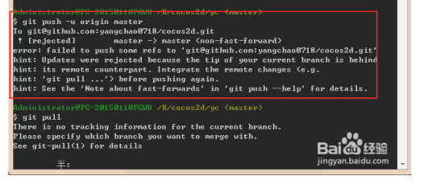

#### #1、创建目录

```git
mkdir project7
```

#### #2、进入目录

```
cd project7
```

#### #3、初始化目录为git项目

```
git init
```

#### #4、创建md文件追加内容# project7(一级标题)

```
echo "# project7" >> README.md
```

#### #5、添加说明文件到暂存区

```
git add README.md
```

#### #6、提交到本地仓库并写日志

```
git commit -m "first commit"
```

#### #7、添加远程主机，主机名为origin 地址为https://git.coding.net/zhangguoGit/project7.git

```
git remote add origin https://git.coding.net/zhangguoGit/project7.git
```

#### #8、本地的master分支推送到origin主机，同时指定origin为默认主机，后面就可以不加任何参数使用git push了，-u 参数指定一个默认主机

```
git push -u origin master
```

如果出现以下错误提示：



##### 	可以通过如下命令进行代码合并【注：pull=fetch+merge]

```
git pull --rebase origin master
```

#### 列出所有本地分支

```
$ git branch
```

#### 列出所有远程分支
```
$ git branch -r
```

#### 列出所有本地分支和远程分支
```
$ git branch -a
```

#### 新建一个分支，但依然停留在当前分支
```
$ git branch [branch-name]
```

#### 新建一个分支，并切换到该分支
```
$ git checkout -b [branch]
```

#### 新建一个分支，指向指定commit
```
$ git branch [branch] [commit]
```

#### 新建一个分支，与指定的远程分支建立追踪关系
```
$ git branch --track [branch] [remote-branch]
```

#### 切换到指定分支，并更新工作区
```
$ git checkout [branch-name]
```

#### 切换到上一个分支
```
$ git checkout -
```

#### 建立追踪关系，在现有分支与指定的远程分支之间
```
$ git branch --set-upstream [branch] [remote-branch]
```

#### 合并指定分支到当前分支
```
$ git merge [branch]
```

#### 选择一个commit，合并进当前分支
```
$ git cherry-pick [commit]
```

#### 删除分支
```
$ git branch -d [branch-name]
```

#### 删除远程分支
```
$ git push origin --delete [branch-name]
$ git branch -dr [remote/branch]
```

#### #统计某人的代码提交量，包括增加，删除：

```
git log --author="$(git config --get user.name)" --pretty=tformat: --numstat | gawk '{ add += $1 ; subs += $2 ; loc += $1 - $2 } END { printf 
"added lines: %s removed lines : %s total lines: %s\n",add,subs,loc }' -
```

#### #仓库提交者排名前 5（如果看全部，去掉 head 管道即可）：

```
git log --pretty='%aN' | sort | uniq -c | sort -k1 -n -r | head -n 5
```

#### #仓库提交者（邮箱）排名前 5：这个统计可能不会太准，因为很多人有不同的邮箱，但会使用相同的名字

```
git log --pretty=format:%ae | gawk -- '{ ++c[$0]; } END { for(cc in c) printf "%5d %s\n",c[cc],cc; }' | sort -u -n -r | head -n 5 
```

#### #贡献者统计：

```
git log --pretty='%aN' | sort -u | wc -l
```

#### #提交数统计：

```
git log --oneline | wc -l 
```

#### 显示有变更的文件
```
$ git status
```

#### 显示当前分支的版本历史
```
$ git log
```

#### 显示commit历史，以及每次commit发生变更的文件
```
$ git log --stat
```

#### 搜索提交历史，根据关键词
```
$ git log -S [keyword]
```

#### 显示某个commit之后的所有变动，每个commit占据一行
```
$ git log [tag] HEAD --pretty=format:%s
```

#### 显示某个commit之后的所有变动，其"提交说明"必须符合搜索条件
```
$ git log [tag] HEAD --grep feature
```

#### 显示某个文件的版本历史，包括文件改名
```
$ git log --follow [file]
$ git whatchanged [file]
```

#### 显示指定文件相关的每一次diff
```
$ git log -p [file]
```

#### 显示过去5次提交
```
$ git log -5 --pretty --oneline
```

#### 显示所有提交过的用户，按提交次数排序
```
$ git shortlog -sn
```

#### 显示指定文件是什么人在什么时间修改过
```
$ git blame [file]
```

#### 显示暂存区和工作区的差异
```
$ git diff
```

#### 显示暂存区和上一个commit的差异
```
$ git diff --cached [file]
```

#### 显示工作区与当前分支最新commit之间的差异
```
$ git diff HEAD
```

#### 显示两次提交之间的差异
```
$ git diff [first-branch]...[second-branch]
```

#### 显示今天你写了多少行代码
```
$ git diff --shortstat "@{0 day ago}"
```

#### 显示某次提交的元数据和内容变化
```
$ git show [commit]
```

#### 显示某次提交发生变化的文件
```
$ git show --name-only [commit]
```

#### 显示某次提交时，某个文件的内容
```
$ git show [commit]:[filename]
```

#### 显示当前分支的最近几次提交
```
$ git reflog
```

#### 下载远程仓库的所有变动
```
$ git fetch [remote]
```

#### 显示所有远程仓库
```
$ git remote -v
```

#### 显示某个远程仓库的信息
```
$ git remote show [remote]
```

#### 增加一个新的远程仓库，并命名
```
$ git remote add [shortname] [url]
```

#### 取回远程仓库的变化，并与本地分支合并
```
$ git pull [remote] [branch]
```

#### 上传本地指定分支到远程仓库
```
$ git push [remote] [branch]
```

#### 强行推送当前分支到远程仓库，即使有冲突
```
$ git push [remote] --force
```

#### 推送所有分支到远程仓库
```
$ git push [remote] --all
```

#### #简单查看远程---所有仓库

```
git remote  （只能查看远程仓库的名字）
```

#### #查看单个仓库

```
git  remote show [remote-branch-name]
```

#### #新建远程仓库

```
git remote add [branchname]  [url]
```

#### #修改远程仓库

```
git remote rename [oldname] [newname]
```

#### #删除远程仓库

```
git remote rm [remote-name]
```

#### #获取远程仓库数据

```
git fetch [remote-name] (获取仓库所有更新，但不自动合并当前分支)
git pull (获取仓库所有更新，并自动合并到当前分支)
```

#### #上传数据，如git push origin master

```
git push [remote-name] [branch]
```

