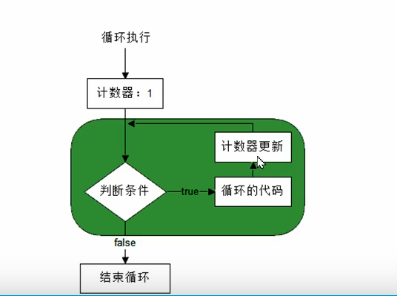
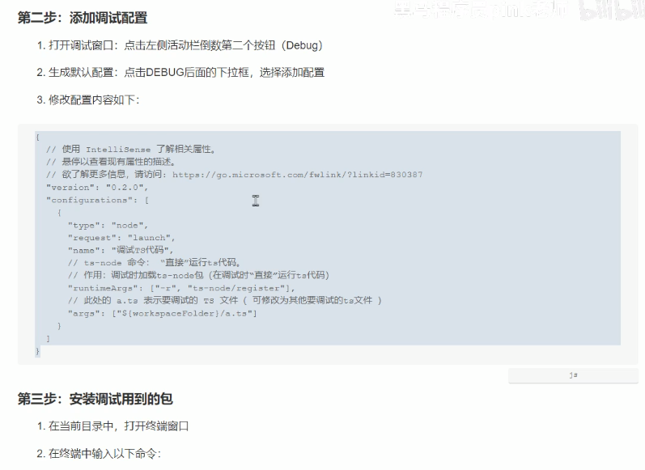
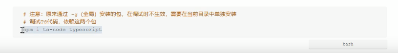

# 第一个 TS 文件

###### 步骤：

1. TS代码 -> JS代码：在当前目录打开终端，输入命令  tsc hello.ts 敲回车。
2. 执行JS： 输入命令 node hell.js

简化 TS 文件转换成 JS 过程：在 VS Code  终端输入命令：npm i -g ts-node，使用方式：ts-node  hello.ts

注释：单行注释---ctrl+/，多行注释---shift+alt+a，

输出语句：console.log()


TypeScript 是 JS 的**超集**，为 JS 添加了**类型系统**

# TypeScript基础知识

### 变量：

1. 存储数据的容器，可以变化。

### 变量的使用：

1. 声明变量并指定类型
2. 给变量赋值

```typescript
let age: number = 18;
```

### 类型注解：

1. 一种**为变量添加类型约束**的方式

### 命名规则和规范：

1. 变量名称只能出现：数字、字母、下划线（_)、美元符合（$）、并且不能以数字开头
2. 变量名称区分大小写。
3. 变量名称要有意义。
4. 变量名称使用驼峰命名发。

### 数据类型概述：

1.  TypeScript 中数据类型分为两大类：原始类型（基本数据类型），对象类型（复杂数据类型）
2.  基本数据类型5个：number / string / boolean / undefined / null。
3.  数字类型：包含整数值和浮点值（小数）。

```typescript
// 数字类型：整数
let age: number = 18;
// 数字类型： 小数
let score: number = 9.99
```

1. 字符串：可以使用 **单引号（‘）**或 **双引号（“）**，推荐：**使用单引号**。

   #### undefined、null

   特点：只有一个值，值是本身。

   undefined：表示 声明但未赋值的变量值

   null：表示声明了变量并已赋值，值为null

### 运算符概述：

1. +号两边只要有一边是字符串，就执行字符串拼接。
2. 在字符串前添加 + 号，可以将String 转化为 number（字符串值需要为数字）。
3. 自增运算符 ++， 自减运算符 --。
4. 比较运算符： 大于：>         小于：<             等于：===        大于等于：>=    小于等于：<=        不等于：!==.
5. 逻辑运算符：&&  并且、|| 或、 ! 非。

### 条件语句：

- if 语句

```typescript
if (判断条件) {
	条件满足时，需要执行的代码块
}
```

- else 语句

```typescript
if (判断条件) {
	条件满足时，需要执行的代码块
} else {
	条件不满足，需要执行的代码块
}
```

- 三元运算法

```
结果 = 判断条件 ? 值1 : 值2
```

### 循环语句：

- for 语句

```typescript
for (初始化语句; 判断条件; 计数器更新) {
	
}
for (let i: number = 1; i <= 3; i++) {
    
}
```



- **break 和 continue**

  **break**  能够让循环提前结束（终止循环）。

  **continue**  跳出当前循环，进入下一次循环。


### VSCode - 断点调试配置





### 数组概述：

- 数组，用于存放多个数据的集合。

  ```typescript
  let names: string[] = ['1', '2', '3']
  // 数组的类型注解有两部分组成： 类型+[], 此处表示字符串类型的数组（只能出现字符串类型）
  ```

- 数组索引，从 0 开始。

- 数组取值

  ```typescript
  数组名称[索引]    names[0]
  ```

- 数组赋值

  ```
  数组名称[索引] = 新值
  ```

- 添加元素

  如果索引不存在则是添加新元素

- 遍历数组

### 函数基本概述：

- 函数概述--函数包装、封装

  ```typescript
  function getSum(nums: number[]) {
  	let sum: number = 0;
  	for (let i: number = 0; i < nums.length; i++) {
  		sum += nums[i]
  	}
  	console.log(sum)
  }
  ```


- 函数参数分为两部分：1、形参  2、实参。

  1. 形参：声明函数时指定的参数，放在声明函数的小括号中。

     ```typescript
     function sing(songName: string) {}
     ```

     

  2. 实参：调用函数时传入的参数，放在调用函数的小括号中。

     ```typescript
     sing('爱')
     ```

- 函数返回值：return   

  1. 函数返回值默认为 void  为空

  2. 基本使用

     - 步骤：1、指定返回值类型   2、指定返回值

       ```typescript
       function fn(): 类型注解 {
       	return 返回值
       }
       ```

  3.  

- 变量作用域：1、局部变量，2、全局变量

  1. 局部变量：表示在函数内部声明的变量，该变量只能在函数内部使用。

     ```typescript
     function fn() {
     	// 变量 num 是局部变量
     	let num: number = 1;
     	console.log(num); //此处可以访问到变量 num
     }
     fn();
     console.log(num); // 此处不能访问到变量 num
     ```

  2. 全局变量：表示在函数外部声明的变量，该变量在当前 ts 文件的任何地方都可以访问。

     ```typescript
     // 变量 num 是全局变量
     let num: number = 1;
     function fn() {
     	console.log(num); //此处可以访问到变量 num
     }
     fn();
     console.log(num); // 此处能访问到变量 num
     ```

### 对象：

- 创建对象

  ```
  let person = {
  	key: value,
  	key2: value2
  }
  ```

- 接口

  1. 对象的类型注解

     ```typescript
     // 对象的类型注解
     let person: {
     	name: string;
     	age: number;
     }
     person = {
     	name: '李四',
     	age: 13
     }
     ```

  2. 对象方法的类型注解

     ```typescript
     let person: {
     	sayHi: () => void;
     	sing: (name: string) => void;
     	sum: (num1: number, num2: number) => number;
     }
     person = {
         sayHi: function() {
             console.log('');
         },
         sing: function(name: string) {
             console.log(name)
         },
         sum: function(num1: number, num2: number) {
             return num1 + num2
         }
     }
     // 箭头（）左边小括号中的内容：表示方法的参数类型。
     // 箭头（）右边的内容：表示方法的返回值类型。
     // 方法类型注解的关键点：1 参数  2 返回值
     ```

  3. 接口的使用

     直接在对象名称后面写类型注解的坏处：1、代码结构不简洁。2、无法复用类型注解。

     接口：为对象的类型注解命名。

     语法：

     ```typescript
     // 创建接口
     // interface 表示接口，接口名称约定以I开头
     interface IUser {
     	name: string;
     	age: number;
     }
     //使用接口
     let p1: IUser = {
     	name: '李四',
     	age: 34
     }
     
     ```

  4. 取值

     通过点语法（.）访问对象属性。

  5. 存值

     通过点语法获取到 name 属性，然后，赋值一个新值。

- 内置对象

  属性和方法，查文档  MDN  、 W3school

- 数组对象

  属性（length）获取数组长度， 方法（push--在最后面追加一个或多个元素并返回数组的新长度，forEach--遍历数组，some--遍历数组，特点：根据回调函数的返回值，决定是否停止循环。返回true-停止，返回false-继续）

  **forEach()：**

  ```typescript
  let ary: number[] = [1, 2, 3, 4];
  ary.forEach(function (item, index){
  	console.log('索引为', index, '元素为', item);
  })
  ```

  **some():**

  ```typescript
  let has: boolean = ary.some(function (num) {
  	if (num > 10) {
  		return true;
  	}
  	return false;
  })
  ```

- ts 类型推论

### Web开发基础

- HTML


- css

  使用 css 的三种方式：

  1. style 属性。
  2. style 标签：在 head 里面创建 style。选择器：标签选择器、id 选择器、类 选择器。
  3. css 文件（在head 中通过 link 标签引入）。

- JavaScript

  使用 JS 的两种方式：

  1. 在标签后面创建 script 标签。
  2. 创建 js 文件，使用 script 标签引入。

- 自动刷新浏览器

  使用 VSCode 的 Live Server 插件，右键 html 选择  Open with Live Server  打开。

- 浏览器中运行 TS

  1. 使用命令 tsc index.ts 将 ts 文件转化为 js 文件。

  2. 在页面中，使用 script 标签引入生成的 js 文件。

  3. 使用 tsc 命令的监视模式可以解决每次修改 ts 文件后都要重新运行 tsc 命令将 ts 转化为 js。

     ```
     tsc --watch index.ts
     ```

- DOM 操作

  文档对象模型、操作网页内容的

  概述---四个常用DOM 操作：

  1. 获取 DOM元素 （DOM对象）。

     常用方法有两个：

     - querySelector(selector)	作用：获取某一个 DOM 元素。

       ```javascript
       document.querySelector(selector)  // selector 参数： 是一个css选择器（标签、类、id选择器）  推荐使用：id选择器
       ```

     - querySelectorAll(selector)    作用：同时获取多个 DOM 元素。

       ```javascript
       document.querySelectorAll(selector)  // 
       ```

     - 类型断言

       值   as   元素的类型

       ```javascript
       let img = document.querySelector('#image') as HTMLImageElement
       ```

       通过 console.dir()  打印 DOM 元素，在属性的最后面，可看到该元素的类型

  2. 设置样式。

     两种方式：

     - dom.style.样式名称 ----  读取      dom.style.样式名称 = 样式值    ----设置      命名规则为驼峰命名法 
     - classList 属性（类样式）：三个常用的方法：add---添加、remove---移除、contains---判断类名是否存在、返回值是 boolean 类型。

  3. 设置内容。

     读取：dom.innerText

     设置：dom.innerText = ''

     注意：需要通过 类型断言 指定DOM的类型

  4. 绑定（解绑）事件。

     - dom.addEventListener(事件名称， 事件处理程序，事件执行次数) -----给 DOM 元素添加事件

       ```typescript
       dom.addEventListener('click', function (event) {
       	// event --- 事件对象
           // event.type    
           // event.target  --- 当前点击元素对象
       }, {once: true}) //事件只触发一次
       ```

     - dom.removeEventListener(事件名称，事件处理程序) -----给 DOM元素移除对应事件

       ```typescript
       function handleClick() {}
       dom.addEventListener('click', handleClick);
       dom.removeEventListener('click', handleClick)
       ```

     - 函数声明形式的事件处理程序

       1. 可以先使用函数，再声明函数。

          ```typescript
          dom.addEventListener('click', handleClick)
          function handleClick () {}
          ```

          原因：函数声明在当前 ts 文件中的任意位置都有定义

          ```typescript
          // 1  先调用函数
          fn()
          // 2 再声明函数
          function fn () { }
          ```

       2. 使用事件对象参数时，应该指定类型注解，否则，访问事件对象的属性时没有任何提示。

          ```typescript
          dom.addEventListener('click', handleClick);
          function handleClick(event: MouseEvent) {
          	console.log(event.target)
          }
          ```

  5. 枚举

     - 枚举是组织有关联数据的一种方式。

     - JS 中没有枚举，

       ```typescript
       // 创建枚举的语法：
       enum 枚举名称 {成员1, 成员2}
       ```

       注意：枚举的成员不是键值对

     - 使用枚举：

       枚举是一种类型，可以作为变量的类型注解

       ```typescript
       enum Gender {Female, Male}
       let userGender: Gender
       ```

       访问枚举中的成员，作为变量的值

       ```typescript
       userGender = Gender.Female
       userGender = Gender.Male
       ```

       枚举成员是有值的，默认为：从 0 开始自增的数值。枚举成员的值为数字的枚举，称为：数字枚举

       可以给枚举中的成员初始化值

       ```
       enum Gender {Female = 1, Male}
       enum Gender {Female = 1, Male = 100}
       ```

       字符串枚举：枚举成员值是字符串，不自增长。

  

