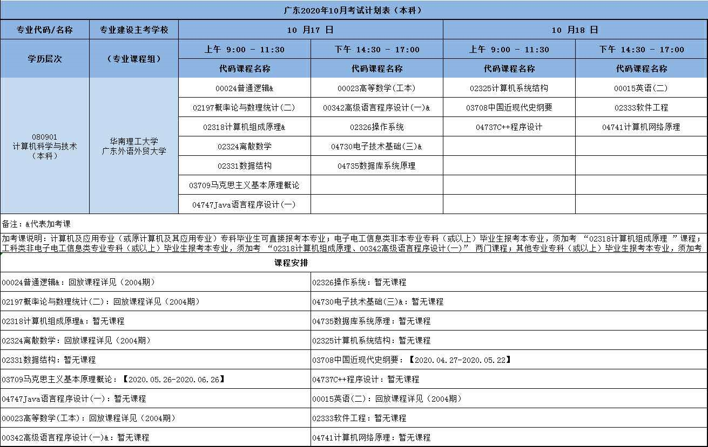

# 计算机科学与技术（本科）专业计划

| 序号   | 课程代码  | 课程名称                 | 学分  | 备注              |
| ------ | --------- | ------------------------ | ----- | ----------------- |
| 01     | 03708     | 中国近现代史纲要         | 2     |                   |
| 02     | 03709     | 马克思主义基本原理概论   | 4     |                   |
| 03     | 00015     | 英语（二）               | 14    |                   |
| 04     | 00023     | 高等数学(工本)           | 10    |                   |
| **05** | **02197** | **概率论与数理统计(二)** | **3** | **10月17日 上午** |
| 06     | 02324     | 离散数学                 | 4     |                   |
| 07     | 02325     | 计算机系统结构           | 4.0   |                   |
| 08     | 02326     | 操作系统                 | 4.0   |                   |
| 09     | 02331     | 数据结构                 | 3.0   |                   |
| 10     | 02333     | 软件工程                 | 3.0   |                   |
| 11     | 04735     | 数据库系统原理           | 4.0   |                   |
| 12     | 04737     | C++程序设计              | 3.0   |                   |
| 13     | 04741     | 计算机网络原理           | 4.0   |                   |
| 14     | 04747     | Java语言程序设计(一)     | 3.0   |                   |
| 15     | 11441     | 计算机及应用课程实验(二) | 9.0   |                   |
| 16     | 10203     | 计算机及应用毕业设计     | 0.0   |                   |

准考证号：011320100477

预报名号：22181017

密码：199512xfz

http://eea.gd.gov.cn/zxks/index.html